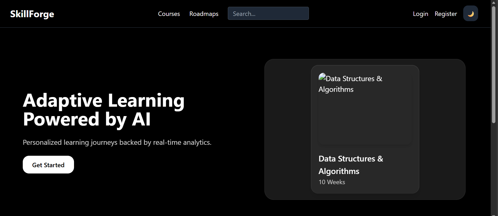
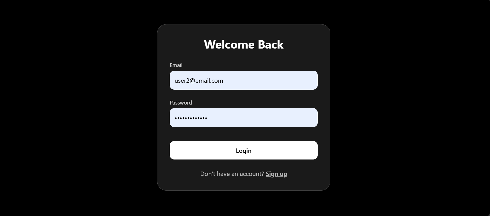
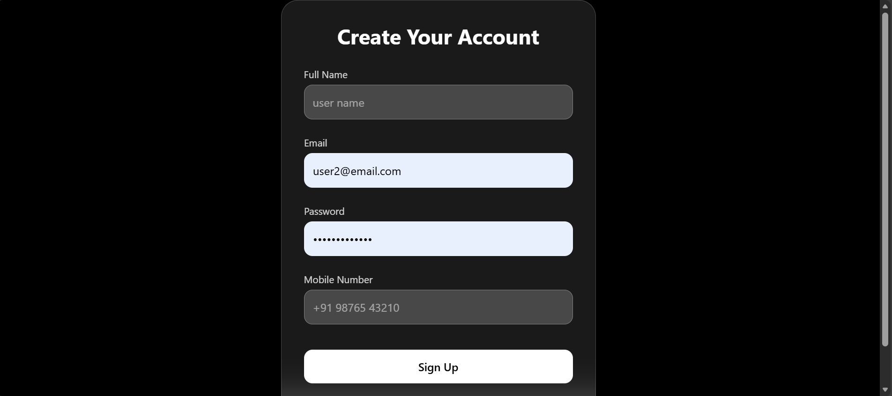
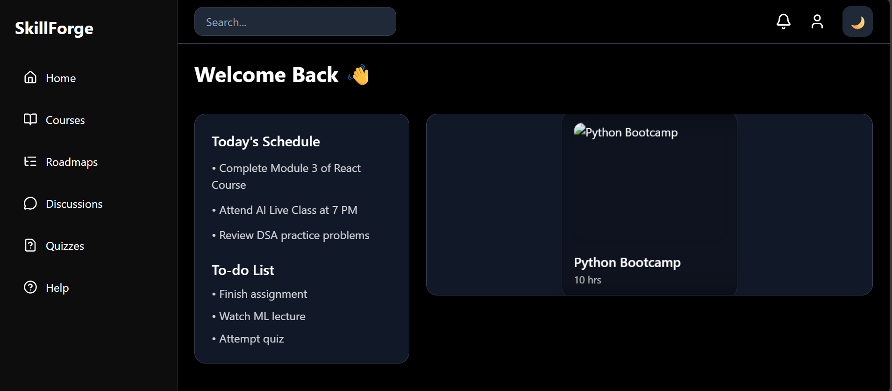
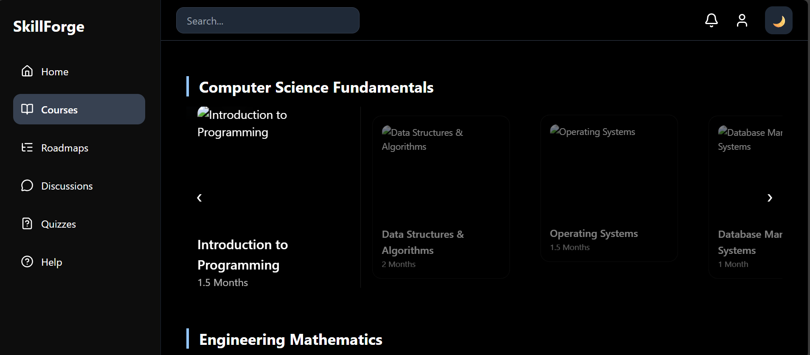
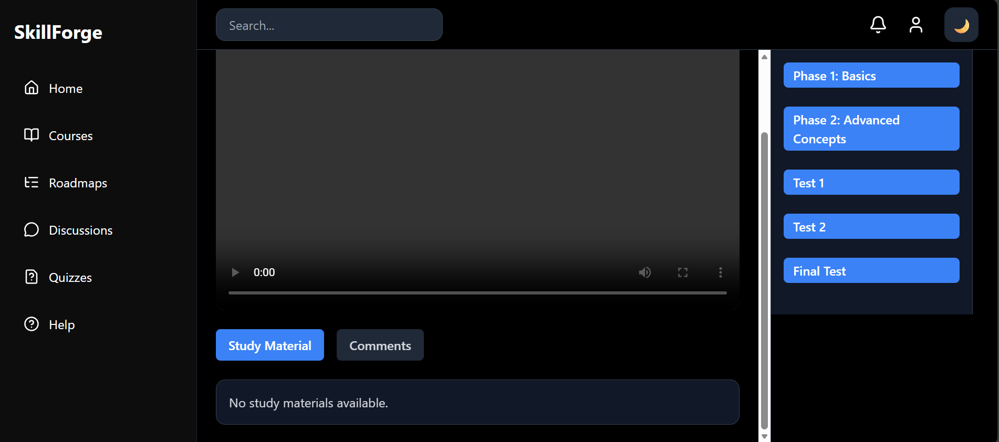

<h1 align="center">🎓 SkillForge Frontend</h1>

AI-powered adaptive learning platform built with React + Tailwind
 
      

🌟 Overview

SkillForge Frontend delivers:

A clean, modern UI for learners

Smooth routing and protected navigation

Fully functional authentication pages

Integration with backend JWT login & registration

Responsive design using Tailwind CSS

🛣️ Routing Structure
⚡ Main Routes  
/ → Landing Page  
/login → Login  
/register → Register  
/home → Home Dashboard (Protected)  
/courses → Course List (Protected)  
/course/:id → Course Dashboard (Protected)  

🔐 Protected Routes

Protected routes use:

AuthContext

JWT from localStorage

Custom PrivateRoute

This ensures only authenticated users can access dashboard and course pages.

🎨 Styling
✨ Tailwind CSS Highlights

Fully responsive layout

Utility-first styling

Custom design for:

Input fields

Buttons

Navigation bars

Course cards

Dashboard layout

⚙️ Project Setup
1️⃣ Clone the Repository
git clone https://github.com/Lokesh3478/skillforge_frontend.git
cd skillforge_frontend

2️⃣ Install Dependencies
npm install

3️⃣ Run Local Dev Server
npm run dev

➡ App runs at http://localhost:5173

📦 Dependencies
💻 Core

React.js

Vite

React Router DOM

Axios

🎨 Styling

Tailwind CSS

PostCSS

🛠 Tooling

ESLint

Prettier (optional)

🚧 Upcoming Enhancements

Course enrollment UI

User profile & settings page

Instructor/Administrator dashboards

Progress tracking & analytics UI

Integration with AI-based assessment modul

### `page layouts`

## `landing page`

## `login and register page`

 

## `Home page`

## `Course List page`

## `Course Dashboard`

